# Curves #

The following curves have been predefined and can be used. Their number can be found in brackets behind the curve name. The blue lines represent the smooth curve; the black line represents the actual line the servo will follow.

The curves are basically copied from the [OpenDecoder 2](https://www.opendcc.de/elektronik/opendecoder/opendecoder_sw_servo.html) of the [OpenDCC project](https://www.opendcc.de/index.html). Except for the semaphore curves (HP0, HP1), they have been slightly modified, to allow starting from 0 or 255 (instead of 30 and 225).

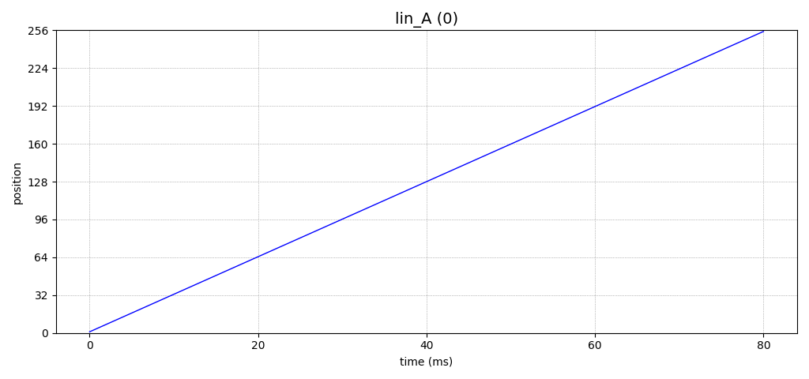

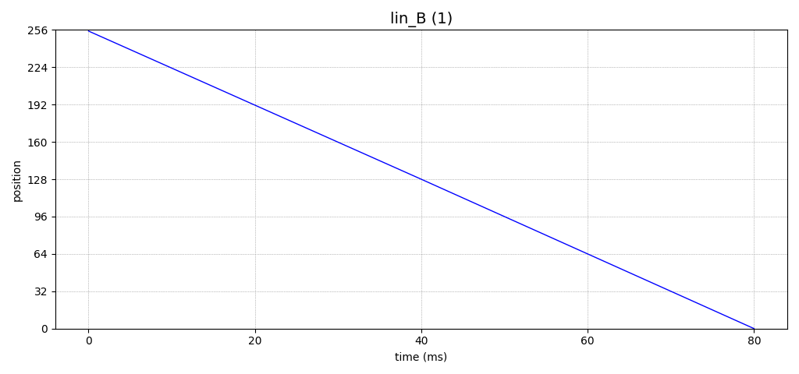

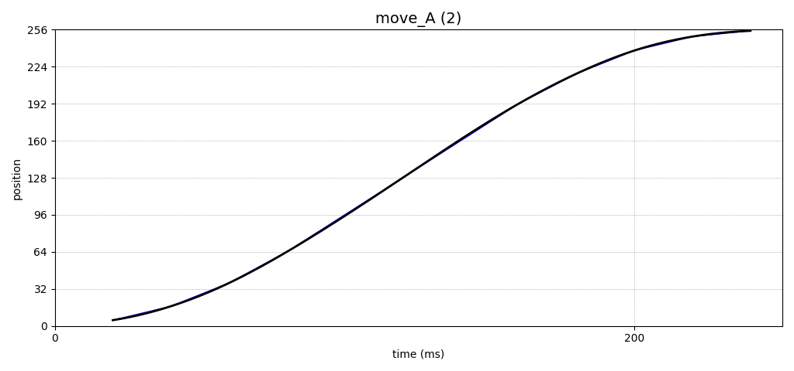

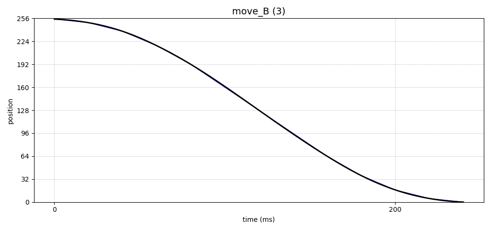

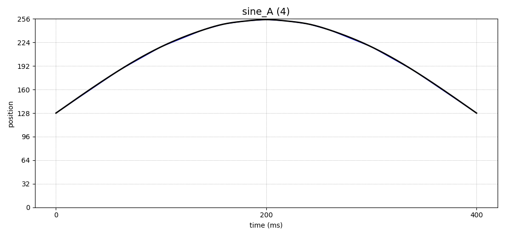

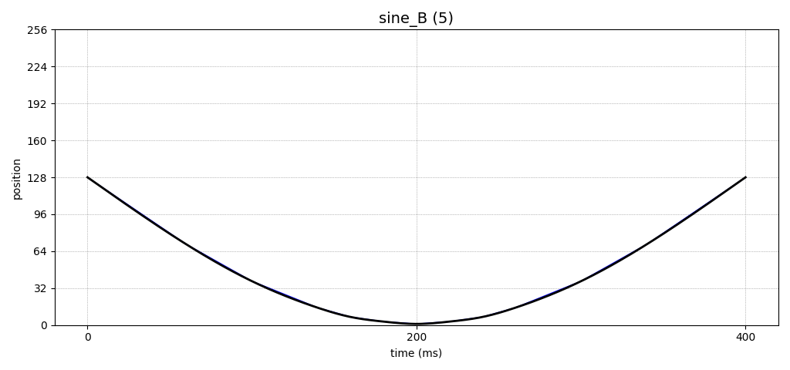

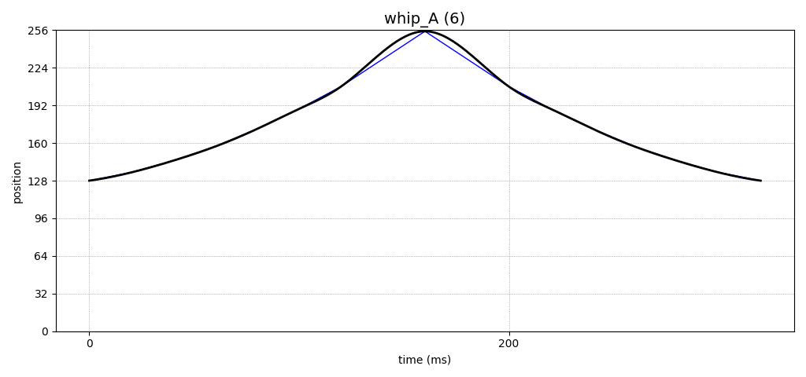

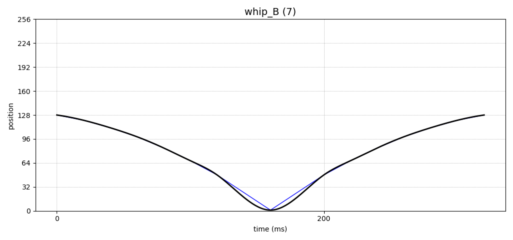

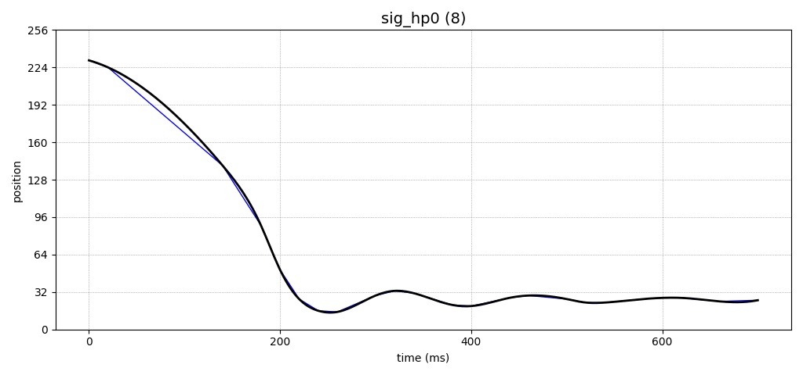

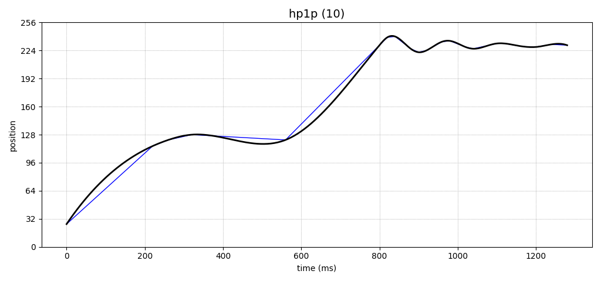

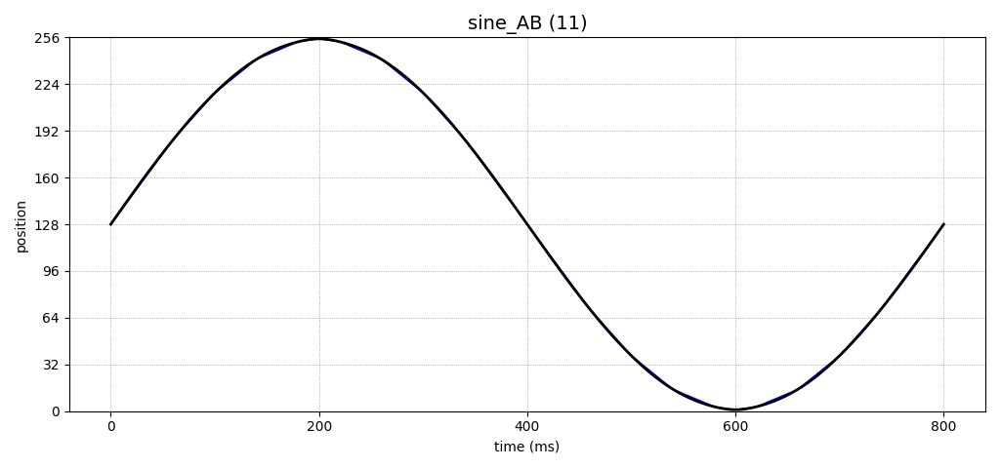
