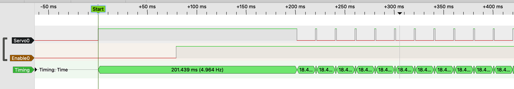

# <a name="PowerOn"></a>Servo Power On #

Different servos behave differently when power is switched on. When power is switched on, many make abrupt short movements. One way to avoid / limit these startup movements, is to ensure that the pulse line is high when the power s switch on. To achieve this, constantOutput(1) should
be called before the servo is attached and the power is supplied to the servo.

You can test this startup behaviour using the sketch [Test_TCA_Power_on.ino](../examples/Test_TCA_Power_on/Test_TCA_Power_on.ino) in the examples directory.

In that sketch edit the #defines to match your board and tests.

    #define SERVO_PIN             PIN_PF0    // Select the pin that suits your board.
    #define SERVO_ENABLE_PIN      PIN_PA1    // Select the pin that suits your board.
    #define STARTUP_LEVEL         1          // 0: low signal (0V), 1 = high signal (3,3 or 5V)
    #define POWER_UP_DELAY        100        // Number of milliseconds to wait before the servo gets power
    #define PULSE_DELAY           100        // Number of milliseconds to wait before the servo gets pulses

Set STARTUP_LEVEL to 0, to give the pulse signal a constant low level (0V). Set it to 1, to give the pulse signal a constant high level (3,3 or 5V).

In the sketch we assume the servo's power can be switch on and off via the SERVO0_ENABLE_PIN
Switching servo power on (and off)  can be done by putting a MOSFET (or a USB Power Distribution
Switch) in series in the servo's 5V power line


### Output ###

<div style="text-align:center"></div>
The figure above shows the result of the sketch. After the servo is attached, a constant HIGH signal is found on the servo's pulse line. After 100ms the servo's power is enabled, and after another 100ms the servo pulses start. Note that the first pulses are not after exactly 200ms, but a bit later. This is because the TCA timer was already started during the attach, and transitions in the pulse signal are synchronised by this timer. As a result, the idle time between pulses will always be stable.

The sketch was tested on AVR64DA28, but is assumed to work on all dxCore and Tiny series 0, 1 and 2 processors.

### References ###

Most details can be found in these references (in German):
- https://www.opendcc.de/elektronik/opendecoder/servo_erfahrungen.html
- https://www.opendcc.de/elektronik/opendecoder/opendecoder_sw_servo.html
- https://www.opendcc.de/info/tipps/servo_ruckeln.html

Some high-level introduction can be found in this reference (in English):
- https://www.opendcc.de/elektronik/opendecoder/opendecoder_sw_servo_e.html

### Code ###
The sketch [can be found](../examples/Test_TCA_Power_on/Test_TCA_Power_on.ino) in the examples section, but is also shown below.

---
```
#include <Arduino.h>
#include <Servo_TCA0.h>                  // For objects of the servo class (TCA0)

#define SERVO_PIN             PIN_PF0    // Select the pin that suits your board.
#define SERVO_ENABLE_PIN      PIN_PA1    // Select the pin that suits your board.
#define STARTUP_LEVEL         1          // 0: low signal (0V), 1 = high signal (3,3 or 5V)
#define POWER_UP_DELAY        100        // Number of milliseconds to wait before the servo gets power
#define PULSE_DELAY           100        // Number of milliseconds to wait before the servo gets pulses

Servo  servo0;                           // Instantiate the three servo's on TCA0

void setup() {
  pinMode(SERVO_ENABLE_PIN, OUTPUT);     // configure the power enable pin as output
  digitalWriteFast(SERVO_ENABLE_PIN, 0); // Make sure the servo doen't got power yet

  servo0.constantOutput(STARTUP_LEVEL);  // Make sure the servo's pulse signal is high / low
  servo0.attach(PIN_PF0);                // attach the servo

  delay(POWER_UP_DELAY);                 // Time we wait before the servo gets power
  digitalWriteFast(SERVO_ENABLE_PIN, 1); // Enable the servo's power

  delay(PULSE_DELAY);                    // Time we wait before the servo gets pulses
  servo0.writeMicroseconds(1500);
}

void loop() {
 // Nothing needed in this example
}
```
